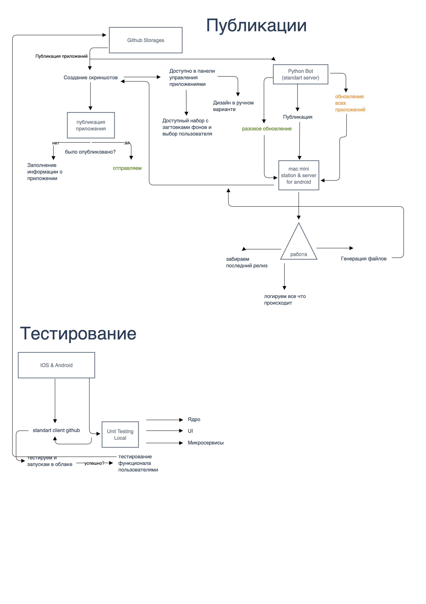

# automate - AppStore Connect 

Example of a server application for macOS - which will facilitate the process of obtaining screenshots automatically through UnitTests UI Xcode and help send to AppStore Connect for publication of applications thanks to fastlane - build service. 

This system is designed to run on the mac mini m1 and used on it - any bugs and bugs please report. 

